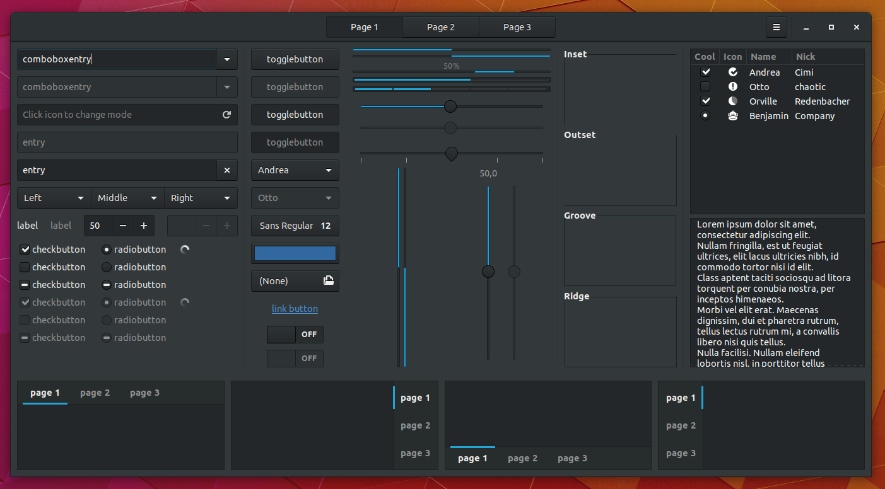

# Adwaita-GTK-Ubuntu

A modern Ambiance replacement that keeps Ubuntu's identity while staying upstream.


## Motivation

Ambiance is over 8 years old now and does not stand a chance against other modern operating systems in terms of both looks and UX, which hurts Ubuntu's reputation and adoption. In [our](https://community.ubuntu.com/t/adwaita-with-unity-8-colours/4041/67) opinion this should be the maintainable theme to use if [Communitheme](https://github.com/Ubuntu/gtk-communitheme) will not get done in time for the Ubuntu 18.04 LTS release. It is not seen as a replacement for Communitheme, but rather as a sane fallback option.

Some of the reasons to use Adwaita (from the [Ubuntu Community Hub](https://community.ubuntu.com/t/adwaita-with-unity-8-colours/4041/2)) instead of Ambiance:

- Adwaita looks more modern than Ambiance
- Adwaita is developed with gnome-shell in mind instead of the now dead Unity Desktop
- Adwaita will be a lot easier to maintain
- Adwaita with Unity8 colors combines GNOME's great UX and the newest Ubuntu Design

## Installation

> A ppa will be provided in the future. Please compile from source for now.

In order to do install the theme, you need to have the ```sassc``` package installed.

```bash
meson build --prefix=/usr
cd build
sudo ninja install
```

Now select the theme in GNOME Tweaks and log out and in again to insure that the theme has been applied completely.

To update the theme after you've made your own changes, just run the following inside the ```build``` directory again:

```bash
sudo ninja install
```

## Screenshots

> In addition to Adwaita-GTK-Ubuntu, there is also Adwaita-Shell-Ubuntu (WIP) and [Adwaita-Icons-Ubuntu](https://github.com/pojntfx/adwaita-icon-theme). These are minimal forks of upstream Adwaita, just like this theme. [Colors from the official Unity8 documentation](https://docs.google.com/document/d/1CjPvxz_dk9Cn5HiZ_d0POYtqNAHjO1c5omAbNjZJiKg/edit) are being used. A [wallpaper](https://ubuntucommunity.s3-us-east-2.amazonaws.com/original/2X/8/858e23528c9942005be17db0634c2a69ea365f3a.jpg) has also been created by [nusi](https://community.ubuntu.com/u/nusi/summary) and can be found in the ```wallpapers``` folder in this repository.

There are multiple color variants that you may choose from:

- Unity8 Light Blue (default), which is ```#23A5D4```
- Unity7 Orange, which is ```#E95420```
- Unity8 Dark Blue, which is ```#335280```

To enable one of them, remove the ```//``` in front of each variant at the bottom of ```Adwaita-Ubuntu/gtk-3.0/_colors.scss``` and the ```#``` at the bottom of ```Adwaita-Ubuntu/gtk-2.0/gtkrc```. Make sure you only have all but one variant commented out!

### Light versions of Nautilus


### Dark versions of Nautilus


### Ambiance's Nautilus for comparison

> Ambiance does not have a dark version.


### Light versions of the GTK3 Widget Factory


### Dark versions of the GTK3 Widget Factory




### Ambiance's GTK3 Widget Factory for comparison

> Ambiance does not have a dark version.


### Extras


> Ambiance does not have a dark version.


